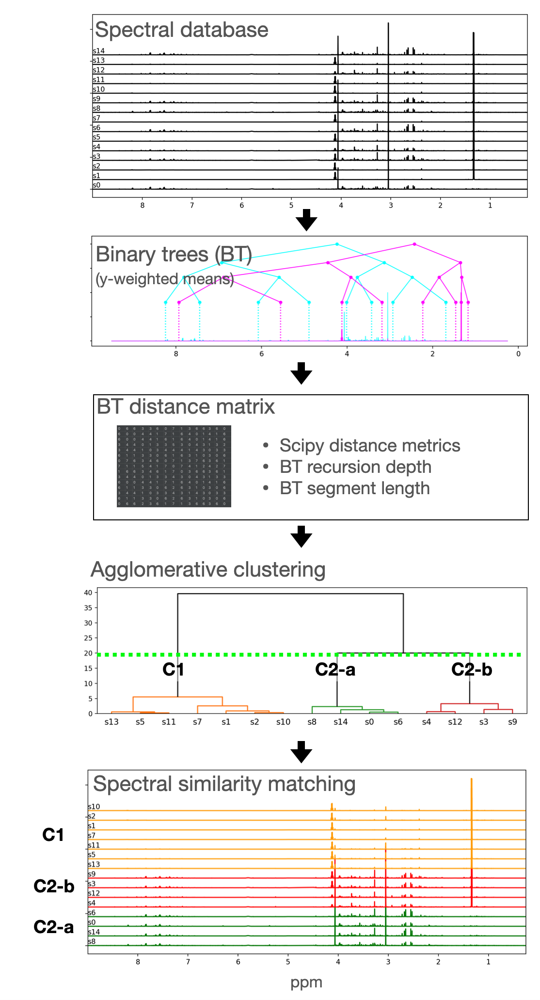

# Fast spectral similarity matching

This algorithm calculates the similarity between spectra based on binary trees, constructed using intensity weighted x-values.

Provided functions for calculating and visualising i) individual binary trees and ii) hierarchical aggolomerative clusterings.

Algorithm adopted from DOI: 10.1016/S0003-2670(00)80840-5

